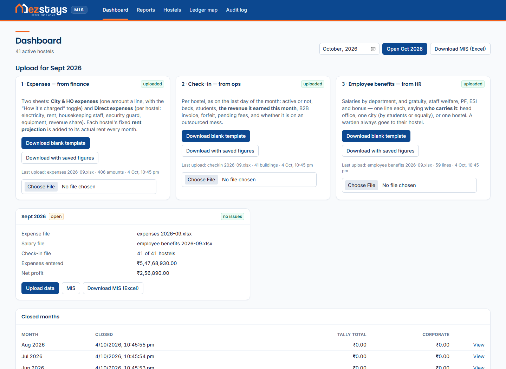
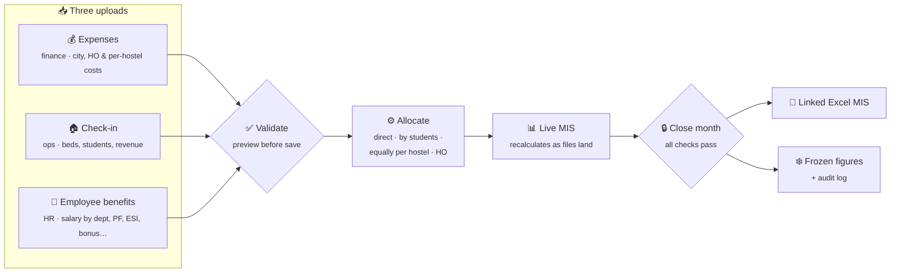
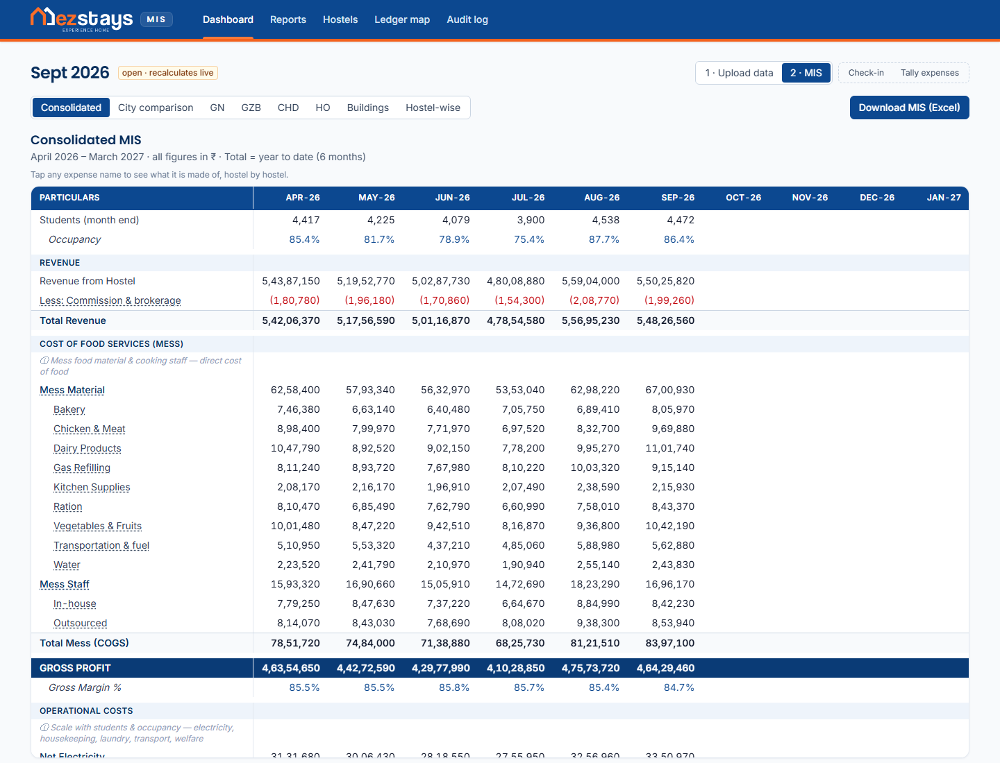
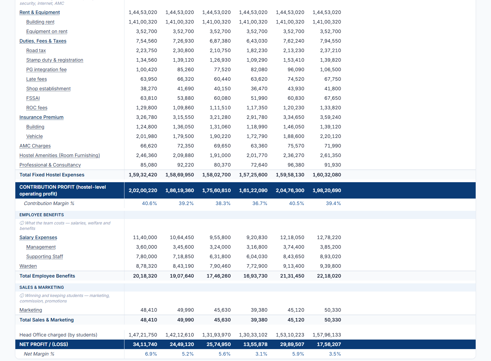
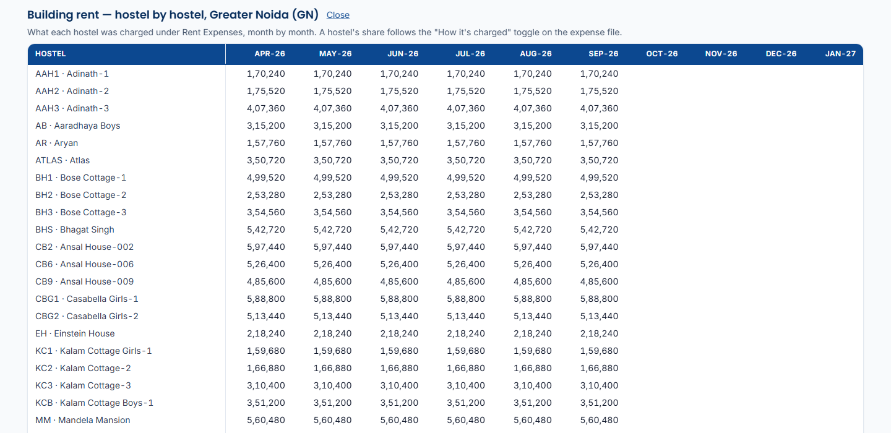
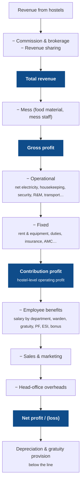
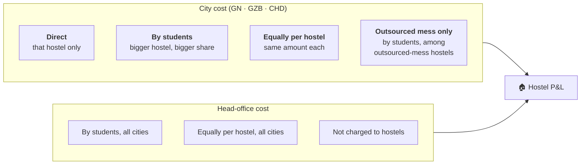
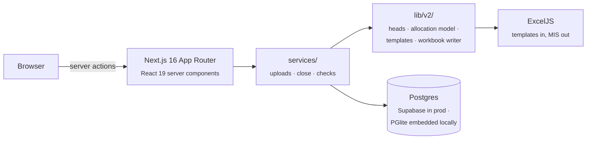

<div align="center">

# EzStays MIS

**The monthly profit & loss engine for a 40-hostel student-housing estate.**
Three spreadsheets go in, a fully-linked, drill-down management income statement comes out.




</div>

---

## Why it exists

Every month, finance used to rebuild a 40-sheet Excel MIS by hand: copy Tally totals, split
each city's shared costs across hostels, chase head-office overheads down to each building,
and cross-check that nothing was counted twice. It took days and nobody fully trusted it.

**EzStays MIS** turns that into a 10-minute job:

| | Before | After |
|---|---|---|
| **Inputs** | Ad-hoc copy-paste from Tally, WhatsApp, HR | 3 fixed templates: **Expenses** (finance), **Check-in** (ops), **Employee benefits** (HR) |
| **Allocation** | Formulas re-typed per sheet | One rule per expense head, a toggle on the template |
| **Checks** | Eyeballing | Blocking checks: a month can't close with a file missing, a blocking issue open, or the previous month still open |
| **Output** | Static workbook | Live screens **and** a linked Excel workbook where every number is a formula you can trace |
| **History** | Overwritten files | Closed months are frozen; reopening needs a reason and is audited |

---

## The monthly cycle



1. **Open the month** on the dashboard. All three upload cards sit right there.
2. **Download each blank template.** It comes pre-filled with the live hostel list, drop-downs and in-sheet checks. Hand it to finance, ops and HR.
3. **Upload the filled files.** Every file is read and shown back for confirmation before anything is saved, and each upload replaces only its own figures.
4. **Watch the MIS build live**, then **close**. Closing freezes the numbers. A closed month never recalculates, whatever changes later.

---

## What the MIS looks like

<table>
<tr>
<td width="50%"></td>
<td width="50%"></td>
</tr>
<tr>
<td align="center"><b>Consolidated MIS</b>: revenue net of commission, mess, gross profit</td>
<td align="center"><b>City console</b>: contribution → employee benefits → HO → net profit</td>
</tr>
</table>

**Every expense name is a link.** Click one and it opens the head hostel by hostel, month by month:



### How the P&L adds up



---

## How costs reach a hostel

Each expense head has one **allocation rule**. Finance can override it per line with the
"How it's charged" toggle on the template.



| Example head | Rule | Why |
|---|---|---|
| Building rent, electricity (net of recovery), housekeeping staff, security guard, warden | **Direct** | Billed to one building |
| Mess material, internet, AMC, marketing, gratuity, PF | **By students** | Scales with occupancy |
| Mess staff, pest control, office expenses | **Equally per hostel** | Same cost per site |
| Outsourced mess contract | **Outsourced-mess hostels only** | Only those hostels use it |

The engine works in **integer paise**. Every split is rounded so the hostel shares add back
to the input exactly, and the test suite proves it for every head.

<details>
<summary><b>📗 The Excel workbook: linked, grouped, traceable</b></summary>

<br>

The download is not a dump of numbers. It's a workbook built like the one finance used to
maintain by hand, with **live formulas** throughout:

| Sheet | What it is |
|---|---|
| **Consolidated MIS** | The estate P&L. Every cell is a formula pointing at the city consoles and HO |
| **Console GN / GZB / CHD** | One sheet per city. Months as column groups, hostel columns collapsed under a Total; heads collapse into parents (`+`/`−` outline) |
| **HO** | Head-office costs and how they were charged out |
| **Employee benefits** | HR's file by department, wardens by city, other benefits |
| **One sheet per hostel** | Each hostel's own P&L, linked to its column in the city console |
| **How it's calculated** | Every rule, in plain English |

A test audits the generated workbook's XML, because Excel silently "repairs" files with
outline flags in the wrong order. That test exists because it happened once.

</details>

<details>
<summary><b>📥 The three upload templates</b></summary>

<br>

| Template | Filled by | Contains |
|---|---|---|
| **Expenses** | Finance | *City & HO expenses*: one amount per head with the "How it's charged" toggle. *Direct expenses*: per hostel electricity, recovery, rent, housekeeping, security, equipment, revenue share. Net electricity and totals are computed in-sheet |
| **Check-in** | Ops | Per hostel: active Y/N, beds, students, revenue earned, B2B invoice, outsourced mess Y/N |
| **Employee benefits** | HR | One line per salary or benefit: department, **charged to** (head office / city by students / city equally / one hostel), amount. A summary panel totals it as the sheet is filled |

Templates are generated from the live hostel list, so a new hostel appears in next month's
files automatically, and a deactivated one disappears.

</details>

<details>
<summary><b>🔐 Security</b></summary>

<br>

- Single shared password gate in `proxy.ts`. Sessions are HMAC-signed tokens with an expiry, compared in constant time.
- **Fails closed**: a hosted deploy with no password configured returns `503` instead of running open.
- Every server action re-checks auth (`requireAuth()`). The proxy is not the only line of defence.
- Redirect targets are sanitised (`safeNext`) against open-redirects.
- Security headers on every response: `frame-ancestors 'none'`, `X-Frame-Options: DENY`, `nosniff`, strict referrer and permissions policies; `X-Powered-By` removed.
- The health endpoint returns timings only, with no environment or config.

</details>

<details>
<summary><b>🧱 Architecture & stack</b></summary>

<br>



| Layer | Choice | Why |
|---|---|---|
| App | Next.js 16 (App Router, server actions), React 19 | One deployable, no separate API |
| Styling | Tailwind CSS v4 | |
| Data | Drizzle ORM on Postgres | Supabase in production; **PGlite** (Postgres in WASM) locally, so it runs with zero setup |
| Spreadsheets | ExcelJS | Reads the uploads, writes the linked MIS |
| Tests | Vitest | 126 tests, including end-to-end upload → close → workbook tie-outs |
| Hosting | Vercel, Mumbai region | Migrations auto-apply on first request |

```
src/
├── app/                 pages + server actions (dashboard, upload, MIS, hostels, audit)
├── components/          upload cards, MIS tables, hostel grid
├── lib/
│   ├── v2/heads.ts      every expense head: rule, category, group
│   ├── v2/mis-model.ts  allocation + P&L rows (pure, testable)
│   ├── v2/templates.ts  the three monthly upload templates
│   ├── v2/mis-workbook*.ts  the linked Excel MIS
│   └── services/        upload, close, checks: the only code that writes
db/migrations/           SQL migrations (applied automatically)
docs/MIS-RULES.md        the accounting rules, in words
scripts/demo.ts          builds a six-month synthetic demo
```

</details>

---

## Try it locally

Needs **Node.js 20+**. Nothing else: the database is embedded.

```bash
npm install
npm run demo        # builds data/demo: six months (Apr–Sep 2026) of synthetic figures
```

Then start the app on the demo database:

```bash
# macOS / Linux
DATABASE_URL=file:./data/demo npm run dev
```

```bat
:: Windows
set DATABASE_URL=file:./data/demo&& npm run dev
```

Open <http://localhost:3000>. The demo is built **through the app's own pipeline**. It
generates the three templates, fills them like finance, ops and HR would, uploads them, and
closes April–August. September stays open, so you can watch it recalculate. Every figure
is invented from a fixed seed, so two runs match.

<details>
<summary><b>Running against your own data</b></summary>

<br>

```bash
npm run setup       # creates data/pglite and loads the hostel list
npm run dev
```

To use a real Postgres server instead, copy `.env.example` to `.env.local` and set
`DATABASE_URL=postgres://…`. On a hosted deploy, set `MIS_PASSWORD` (and ideally
`AUTH_SECRET`). Without a password the app refuses to serve.

Only one process can open the embedded database at a time, so stop `npm run dev` before
running `setup`, `backup` or a restore.

</details>

<details>
<summary><b>Tests</b></summary>

<br>

```bash
npm test
```

Covers allocation (every split ties back to the paisa), template round-trips (build →
fill → read), each upload replacing only its own source, the close rules, the Employee
benefits sheet tying to the consolidated, auth tokens and redirects, and a structural
audit of the generated workbook.

</details>

---

<div align="center">
<sub>Built for <b>Next 2 Door Living</b> (EzStays · Basecamp) · screenshots show synthetic demo data only</sub>
</div>
